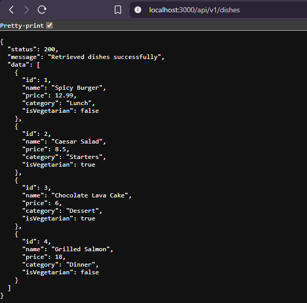

# RESTful API Activity - Myren Joy N. Lawig

## Best Practices Implementation

**1. Environment Variables:**
- Why did we put `BASE_URI` in `.env` instead of hardcoding it?
- Answer: Putting `BASE_URI` in `.env` allows configuration changes without modifying the source code. This makes the application easier to maintain and safer across different environments.

**2. Resource Modeling:**
- Why did we use plural nouns (e.g., `/dishes`) for our routes?
- Answer: Plural nouns represent a collection of resources following RESTful API conventions. This makes the API more consistent and easier to understand.

**3. Status Codes:**
- When do we use `201 Created` vs `200 OK`?
- Answer: `201 Created` is used when a new resource is successfully created using a POST request. `200 OK` is used when a request succeeds and returns data or confirms an update.

- Why is it important to return `404` instead of just an empty array or a generic error?
- Answer: Returning `404` clearly indicates that the requested resource does not exist. This helps clients properly handle errors instead of assuming the request was successful.

**4. Testing:**
(Paste a screenshot of a successful GET request here)

